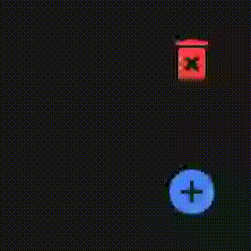
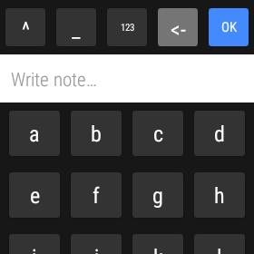
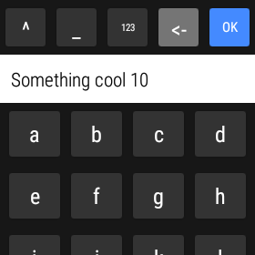
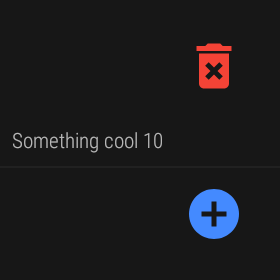
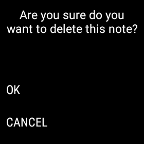
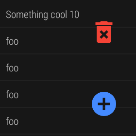
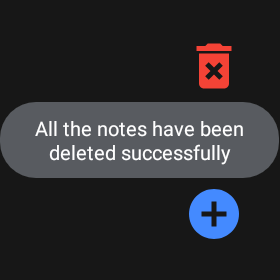

# Wear Offline Notes
App for writing offline notes with a custom keyboard for Wear OS smartwatches.

## Demo
You can check the app installing it directly on [Google Play](https://play.google.com/store/apps/details?id=soy.gabimoreno.offlinenotes).

 

## Screenshots
 







## About
I have implemented this project because I have got an old Android watch that the system soft keyboard does not work properly.
I wanted to save notes when I do sports and the requirements were the following ones:
- Easy to use 
- Fully offline
- Save data persistently
- Use a custom keyboard

The idea of using voice notes is not the best option for me.
I prefer to write directly 1 or 2 words by keys and when I arrive at home, I do actions with those stored inputs.

## Special Thanks
This project has been implemented using part of the code and ideas from [Wear-Keyboard](https://github.com/idoideas/Wear-Keyboard) by [Ido Ideas](https://github.com/idoideas).

## License

```
  Copyright (C) 2019-2020 Gabi Moreno
 
  Licensed under the Apache License, Version 2.0 (the "License");
  you may not use this file except in compliance with the License.
  You may obtain a copy of the License at
 
      http://www.apache.org/licenses/LICENSE-2.0
 
  Unless required by applicable law or agreed to in writing, software
  distributed under the License is distributed on an "AS IS" BASIS,
  WITHOUT WARRANTIES OR CONDITIONS OF ANY KIND, either express or implied.
  See the License for the specific language governing permissions and
  limitations under the License.
```
